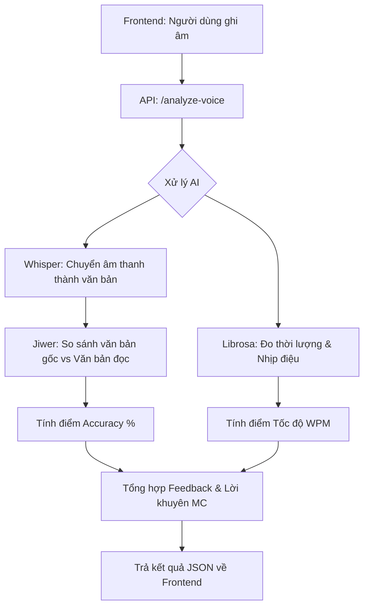

# 🎙️ The MC Hub AI - Training AI Sample

Đây là thư mục chứa các công cụ và script cần thiết để huấn luyện (Training), tiền xử lý dữ liệu âm thanh và chạy lõi AI cho hệ thống MC Hub. Thư mục này được tách riêng để bạn có thể dễ dàng quản lý và đẩy lên kho lưu trữ code (Git).

---

## 🛠️ Danh mục các File và Chức năng

### 1. File Chính (Core)

* **`main.py`**: Trái tim của hệ thống. Chứa toàn bộ API và logic điều khiển AI.
  * Cổng mặc định: `8000`.
  * Tải mô hình **Whisper** (STT) và **VITS** (TTS) khi khởi động.
  * Xử lý logic chấm điểm độ chính xác và tính toán WPM (Words Per Minute).
* **`requirement.txt`**: Danh sách tất cả các thư viện Python cần thiết (`fastapi`, `whisper`, `librosa`, `torch`,...).

### 2. File Hỗ trợ Dữ liệu & AI

* **`download_model.py`**: Script tự động tải mô hình TTS gốc (`facebook/mms-tts-vie`) từ Hugging Face về thư mục cục bộ.
* **`fetch_samples.py`**: Thu thập các bộ dữ liệu giọng nói MC mẫu (Nguyễn Ngọc Ngân, BTV Thời sự,...) để làm tài liệu tham khảo.
* **`preprocess_audio.py`**: Tiền xử lý âm thanh thô (cắt ghép, khử nhiễu, gán nhãn) để chuẩn bị cho quá trình huấn luyện (Fine-tuning) giọng nói mới.

### 3. Tài liệu Hướng dẫn

* **`FINETUNE_GUIDE.md`**: Cẩm nang chi tiết cách sử dụng bộ công cụ **GPT-SoVITS** để huấn luyện một giọng nói MC mới từ dữ liệu riêng của bạn.

---

## 🚀 Quy trình Hoạt động (Workflow)



### Các bước thực hiện chi tiết:

1. **Nhận yêu cầu:** Backend nhận file `.wav`/`.blob` và đoạn văn bản mẫu (Script) từ phía Frontend.
2. **Giải mã âm thanh:** Sử dụng `static-ffmpeg` để làm cầu nối cho các thư viện AI có thể đọc dữ liệu âm thanh trên Windows.
3. **Nhận diện giọng nói (STT):** Mô hình **Whisper (Base)** nghe file ghi âm và chuyển nó thành văn bản thuần túy.
4. **Phân tích kỹ thuật:**
   * **WER (Word Error Rate):** So sánh từng từ để tìm ra các từ đọc sai hoặc bỏ sót.
   * **Signal Analysis:** Librosa phân tích sóng âm để xác định chính xác thời gian nói thực tế (loại bỏ các đoạn im lặng).
5. **Chuyên gia ảo (Expert Advice):** Dựa trên kết quả đo đạc, hệ thống so sánh với bộ quy tắc MC tiêu chuẩn để đưa ra lời khuyên (Ví dụ: "Hãy nhấn mạnh vào tên thương hiệu", "Cần giảm tốc độ ở đoạn kết").

---

## ⚙️ Hướng dẫn Khởi động cho Nhà phát triển

### Yêu cầu hệ thống:

* Python 3.9+
* FFmpeg (Đã được tích hợp sẵn qua `static-ffmpeg` trong code).

### Các bước chạy:

1. **Cài đặt môi trường:**
   ```bash
   pip install -r requirement.txt
   ```
2. **Tải Model (Chỉ cần chạy lần đầu):**
   ```bash
   python download_model.py
   ```
3. **Khởi chạy Server:**
   ```bash
   python -m uvicorn main:app --host 127.0.0.1 --port 8000 --reload
   ```

---

## 📡 Danh sách API (Endpoints)

| Method   | Endpoint               | Chức năng                       | Tham số chính                            |
| -------- | ---------------------- | --------------------------------- | ------------------------------------------ |
| `POST` | `/analyze-voice`     | Phân tích bài đọc của MC    | `file` (audio), `script_origin` (text) |
| `POST` | `/generate-mc-voice` | Tạo giọng nói MC từ văn bản | `text`                                   |
| `GET`  | `/`                  | Kiểm tra trạng thái Server     | Không                                     |

---

*Dự án được phát triển bởi The MC Hub Team - Hệ thống huấn luyện MC ứng dụng AI.*
